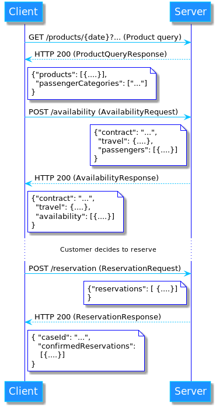

# API
General documentation for the Lippu-API. The
[Lippu-API swagger-definition](../yaml/api.yml) has detailed
definitions and descriptions for the requests and responses.

## Authentication flow
The authentication flow uses public-private key cryptography (see
below for the sequence diagram of the authentication process). Authentication
requires the client side to register their public key to the server side
before attempting to authenticate. As this is public key, it can be send via
email or have some other procedure for this.

In the first step, the client initiates the authentication process by sending
*AuthenticationInitRequest* to the server. The server generates a server side nonce for the client,
stores it and responds with *AuthenticationInitResponse*. The client then generates
a client side nonce and calculates cryptographic signature for base64 encoded
value of the nonces (see section Signature and verification).
Client sends *AuthenticationRequest* to the server, server
verifies the client's nonce is still valid and then verifies the
the signature using the client's public key.
If the signature is valid, server responds with *AuthenticationResponse*, which
has a authentication token, which can be used to 

### Signature and verification
This process is similar on server side and client side. The signature is created
by catenating the server side nonce and client side nonce together.
The result is then encoded with base64 and then signed with client's
private key. Signature verification is similar, server catenates
the nonces and base64 encodes the result.
The server can verify the signature using the signature, the client's public key and
the base64 value of nonces. It is suggested to use at least 2048 bit RSA keys and SHA256 algorithm
for the signature.

## Ticket reservation flow
The ticket reservation is three part process:
1. Product query
2. Availability query
3. Reservation

All the querys require authentication token from the
authentication flow. The token is sent in a http header.
The sequence diagram for the ticket reservation
flow is below.

### Product query
Product query retrieves the available products from the travel transportation
service. Client can limit the query results by date, coordinates and required
accessibility features. The server responds with the products that satisfy
the query parameters, its accessibility features, extra services available
and passenger categories available for the product.

### Availability query
After having the products, the client can query if the travel transportation
service has the capacity to fulfill travel requirements. The query will have:
* travel information, from where (coordinate or stop id), to where (coordinate or stop id)
* travel time 
* passenger information (passenger category, extra services, accessibility services)
* contract

If the server has capasity to fulfill the travel, it will do a soft booking
for the travel, meaning the booking is valid for a short period of time
to complete the reservation before expiring.
Then the server responds with the reservation data
for the travels and how long the soft booked reservation is valid. The response also
has the transport vehicle information. The reservation data must uniquely
identify the travel to the travel transport service.

### Reservation
If the customer accepts the offered booking, permanent reservation
is made. The client sends the confirmed reservations by sending
the reservationdata back to the server with optional customer information.
The server responds with the ticket payloads for the reservations, which
the client can forward to the customer.

## Payment 
Payment for tickets is outside of the scope of the project. For payment, there exists
already options in other channels.

## Ticket format
This specification does not dictate any format for the tickets, but
it has field to transfer the payload. The parties can decide a suitable
ticket format, so that the tickets can be validated by the travel transport operator.   

