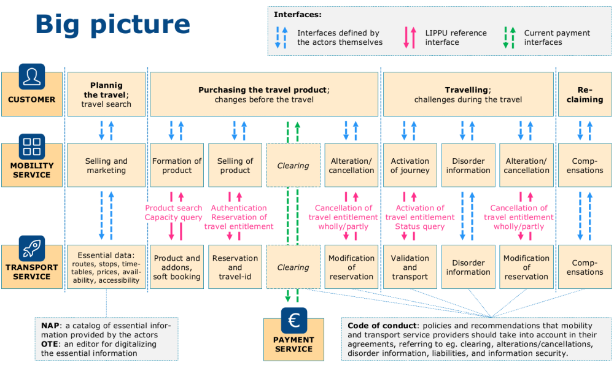

# Introduction
The Lippu-API is an interface definition to expose
passenger transport ticketing services to external
partners. It provides product and availability queries,
travel reservation and cancellation and individual
travel entitlement status, activation and cancellation.   

The API is meant to be generic and to be usable in
demand and timetable based trafic, but also the same
time be compact. It does not provide every necessary
service to implement every part of the travel
from planning a travel and buying tickets to a
possible reclemation. The big picture diagram below
shows to what parts of a travel Lippu-API is designed to be used. 

